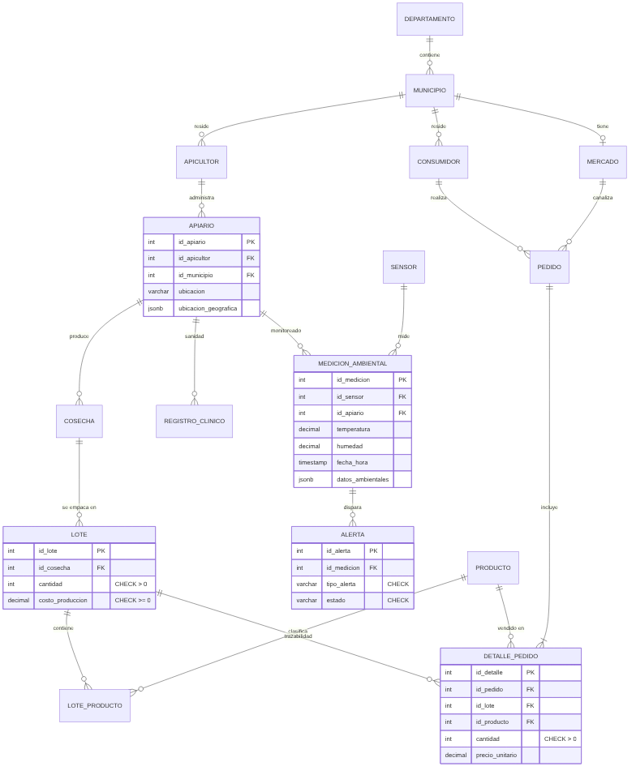

<div align="center">

# 🐝 API-KONNECT

### Inteligencia para cada colmena

**Sistema de información que conecta a los apicultores colombianos con sus colmenas, sus mercados y sus consumidores.**


</div>

---

## El problema

Cerca del **75 % de los cultivos del mundo** dependen, al menos en parte, de polinizadores (FAO, 2023). En Colombia la apicultura crece y tiene ley propia (**Ley 2193 de 2022**), pero la producción nacional de miel cubría apenas **un tercio de la demanda** y el resto se importaba.

En el campo, la información está dispersa: el apicultor no sabe a tiempo que una colmena está en riesgo, vende a intermediarios sin conocer su mercado, y el consumidor no tiene forma de saber de dónde viene la miel que compra.

## La solución

API-KONNECT reúne en una sola base de datos toda la cadena apícola:

| | Capacidad | Pregunta que responde |
|---|---|---|
| 🌡️ | **Salud de la colmena** | ¿Qué colmenas tienen temperatura o humedad fuera de rango, y a quién llamo? |
| 🍯 | **Trazabilidad** | Este frasco, ¿de qué lote, cosecha, apiario y apicultor salió? |
| 🛒 | **Comercio directo** | ¿Cuánto vende cada productor, en qué municipio y de qué producto? |
| 🤝 | **Economía solidaria** | ¿Qué cooperativas, comunidades y entidades financieras apoyan a cada productor? |

## El sistema en números

| 33 tablas | 36 llaves foráneas | 12 reglas de negocio (CHECK) | 3 motores SQL |
|:---:|:---:|:---:|:---:|
| **100** apicultores | **200** apiarios | **2.000** consumidores | **2.000** pedidos |

> Datos de prueba simulados para validar el modelo con volumen realista: 10 departamentos, 39 municipios, ≈ $2.031 millones COP en ventas.

## Modelo de datos



Detalle completo, inventario por módulo y decisiones de diseño: **[docs/modelo-datos.md](docs/modelo-datos.md)**

## Pruébalo en 2 minutos

**Con Docker**

```bash
docker compose up -d
docker compose exec db psql -U apikonnect -d apikonnect -f /demo/demo_pitch.sql
```

**Con PostgreSQL instalado**

```bash
createdb apikonnect
cd database
psql -d apikonnect -f instalar.sql
psql -d apikonnect -f demo_pitch.sql
```

**Con pgAdmin:** crea la base `apikonnect`, abre y ejecuta `database/01_esquema.sql`, luego `database/02_datos_prueba.sql`, y por último `database/demo_pitch.sql`.

## Estructura

```
apikonnect/
├── database/
│   ├── 01_esquema.sql              # 33 tablas, llaves y restricciones
│   ├── 02_datos_prueba.sql         # ~10.000 registros de prueba
│   ├── instalar.sql                # instala todo con un comando
│   ├── demo_pitch.sql              # 7 consultas que cuentan la historia
│   ├── consultas/                  # actualizaciones, JOIN, KPIs, vista, parámetros, ACID, JSONB
│   └── multi-sgbd/                 # mismo modelo en MySQL y SQL Server
├── docs/
│   ├── modelo-datos.md             # diagrama, módulos y decisiones de diseño
│   ├── impacto-ods.md              # impacto y Objetivos de Desarrollo Sostenible
│   ├── vision-y-hoja-de-ruta.md    # de la base de datos al flujo IoT + analítica
│   └── entregas/                   # informes técnicos del curso
├── equipo/
└── docker-compose.yml
```

## Impacto

Alimentación, salud, economía rural, economía sostenible, impacto social y economía emergente, alineado con los **ODS 1, 2, 3, 8, 9, 12, 15 y 17**.
**[docs/impacto-ods.md](docs/impacto-ods.md)**

## Hacia dónde vamos

La base de datos es el cimiento. Lo siguiente es el flujo de datos desde sensores IoT, archivos y APIs abiertas (IDEAM, SIOC), con almacenamiento mixto y tableros de analítica.
**[docs/vision-y-hoja-de-ruta.md](docs/vision-y-hoja-de-ruta.md)**

## Equipo

<table>
  <tr>
    <td align="center"><br><b>Adel Ángel Ramos Chamorro</b><br>Líder</td>
    <td align="center"><br><b>Jerónimo Hoyos Jurado</b></td>
    <td align="center"><br><b>Juan José Rentería Sánchez</b></td>
    <td align="center"><br><b>Salomé Murillo Montoya</b></td>
  </tr>
</table>

**Institución Universitaria Pascual Bravo** · Ingeniería de Software · Base de Datos I (SD1006), grupo 51, 2026-1
**Docente:** Jaime Ernesto Soto Urdaneta

El historial completo de entregas del curso está en el [repositorio académico original](https://github.com/adelramos424/bd1-20261-g051-grupo5).
