# Modelo de datos

El modelo de API-KONNECT tiene **33 tablas** en PostgreSQL, normalizadas hasta **3FN**, con **36 llaves foráneas** y **12 restricciones CHECK** que hacen cumplir reglas del negocio directamente en la base de datos.

## Diagrama del núcleo

Las tablas que sostienen la cadena **colmena → cosecha → lote → pedido → consumidor** y el monitoreo IoT:

```mermaid
erDiagram
    DEPARTAMENTO ||--o{ MUNICIPIO : contiene
    MUNICIPIO ||--o{ APICULTOR : "reside"
    MUNICIPIO ||--o{ CONSUMIDOR : "reside"
    MUNICIPIO ||--o| MERCADO : "tiene"
    APICULTOR ||--o{ APIARIO : "administra"
    APIARIO ||--o{ COSECHA : "produce"
    APIARIO ||--o{ REGISTRO_CLINICO : "sanidad"
    APIARIO ||--o{ MEDICION_AMBIENTAL : "monitoreado"
    SENSOR ||--o{ MEDICION_AMBIENTAL : "mide"
    MEDICION_AMBIENTAL ||--o{ ALERTA : "dispara"
    COSECHA ||--o{ LOTE : "se empaca en"
    LOTE ||--o{ LOTE_PRODUCTO : "contiene"
    PRODUCTO ||--o{ LOTE_PRODUCTO : "clasifica"
    CONSUMIDOR ||--o{ PEDIDO : "realiza"
    MERCADO ||--o{ PEDIDO : "canaliza"
    PEDIDO ||--|{ DETALLE_PEDIDO : "incluye"
    LOTE ||--o{ DETALLE_PEDIDO : "trazabilidad"
    PRODUCTO ||--o{ DETALLE_PEDIDO : "vendido en"

    APIARIO {
        int id_apiario PK
        int id_apicultor FK
        int id_municipio FK
        varchar ubicacion
        jsonb ubicacion_geografica
    }
    MEDICION_AMBIENTAL {
        int id_medicion PK
        int id_sensor FK
        int id_apiario FK
        decimal temperatura
        decimal humedad
        timestamp fecha_hora
        jsonb datos_ambientales
    }
    ALERTA {
        int id_alerta PK
        int id_medicion FK
        varchar tipo_alerta "CHECK"
        varchar estado "CHECK"
    }
    LOTE {
        int id_lote PK
        int id_cosecha FK
        int cantidad "CHECK > 0"
        decimal costo_produccion "CHECK >= 0"
    }
    DETALLE_PEDIDO {
        int id_detalle PK
        int id_pedido FK
        int id_lote FK
        int id_producto FK
        int cantidad "CHECK > 0"
        decimal precio_unitario
    }
```

## Inventario por módulo

| Módulo | Tablas | Para qué sirve |
|---|---|---|
| **Territorio** | `departamento`, `municipio` | Ubicar productores, consumidores y mercados en el mapa del país |
| **Productores** | `apicultor`, `apiario`, `gestion`, `empleo` | Quién produce, dónde, y qué empleo genera |
| **Producción** | `cosecha`, `lote`, `producto`, `lote_producto` | Seguir cada lote desde la colmena hasta el producto |
| **Salud de la colmena** | `sensor`, `medicion_ambiental`, `historial_sensor`, `alerta`, `registro_clinico` | Monitoreo IoT, alertas tempranas y registro sanitario |
| **Comercio** | `consumidor`, `mercado`, `pedido`, `detalle_pedido` | Venta directa del productor al consumidor, con trazabilidad por lote |
| **Economía solidaria** | `cooperativa`, `apicultor_cooperativa`, `comunidad`, `apicultor_comunidad`, `intercambio`, `detalle_intercambio`, `apicultor_intercambio` | Asociatividad, trueque e intercambio entre productores |
| **Financiación** | `entidad_financiera`, `cooperativa_financiera` | Conectar cooperativas con crédito y apoyo |
| **Calidad y regulación** | `entidad_reguladora`, `certificacion` | Certificaciones sanitarias y de origen |
| **Conocimiento** | `investigacion`, `evento`, `evento_apicultor` | Investigación aplicada y capacitación |

## Decisiones de diseño

- **Trazabilidad por lote.** `detalle_pedido` guarda el `id_lote`, no solo el producto. Eso permite responder, para cualquier venta, de qué cosecha, apiario y apicultor salió.
- **SQL + NoSQL en la misma base.** Los datos estables van en columnas relacionales; la geolocalización del apiario y las lecturas ambientales variables van en `JSONB`, que se puede consultar e indexar sin cambiar el esquema.
- **Reglas en la base, no solo en la app.** Precios y cantidades no negativos, estados de alerta, tipos de mercado y estados de intercambio se validan con `CHECK`. Un dato inválido no entra, venga de donde venga.
- **Llaves compuestas para relaciones M:N.** Apicultor–cooperativa, apicultor–comunidad, lote–producto, etc., se resolvieron con tablas intermedias de llave compuesta.
- **Portabilidad.** El mismo modelo se implementó en PostgreSQL, MySQL y SQL Server (`database/multi-sgbd/`).

## Datos de prueba

| Entidad | Registros |
|---|---|
| Departamentos / municipios | 10 / 39 |
| Apicultores / apiarios | 100 / 200 |
| Cosechas / lotes | 400 / 400 |
| Consumidores / pedidos | 2.000 / 2.000 |
| Líneas de pedido | 4.009 |
| Ventas simuladas | ≈ $2.031 millones COP (año 2025) |

> Los datos son **simulados** para validar el modelo bajo volumen realista. No son cifras reales del sector.
