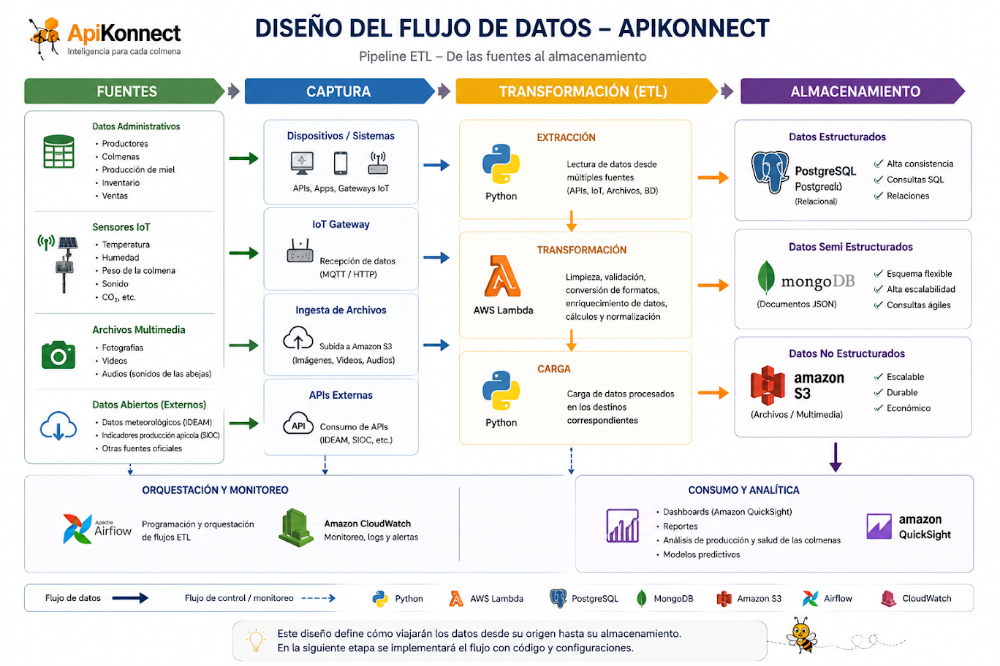

# Visión y hoja de ruta

API-KONNECT se construye por etapas. La base de datos que está en este repositorio es el **cimiento**: todo lo demás (sensores, flujo de datos, tableros, modelos predictivos) se apoya en ella.

*Visión de arquitectura y flujo de datos propuesta por el profesor Jaime E. Soto U. para el proyecto de extensión.*

## Dónde estamos

| Etapa | Estado | Qué incluye |
|---|---|---|
| **1. Modelo conceptual y lógico** | ✅ Hecho | Diagrama E-R (Chen), normalización 1FN → 3FN, diccionario de datos |
| **2. Modelo físico** | ✅ Hecho | DDL en PostgreSQL, MySQL y SQL Server; diccionario físico; datos semiestructurados (JSONB) |
| **3. Manipulación y calidad** | ✅ Hecho | ~10.000 registros de prueba, consultas con JOIN y agregación, vista de ventas, consultas parametrizadas, pruebas ACID |
| **4. Flujo de datos (ETL)** | 🔜 Siguiente | Captura desde sensores IoT, archivos y APIs abiertas (IDEAM, SIOC); transformación en Python / AWS Lambda; orquestación con Airflow |
| **5. Almacenamiento mixto** | 🔜 | PostgreSQL (estructurado), MongoDB (semiestructurado), Amazon S3 (fotos, videos, audios de la colmena) |
| **6. Consumo y analítica** | 🔭 Visión | Tableros (QuickSight), reportes de producción y salud, modelos predictivos |

## Por qué el modelo actual ya está listo para lo que viene

- **Las tablas de IoT ya existen.** `sensor`, `medicion_ambiental`, `historial_sensor` y `alerta` reciben lo que el gateway IoT capture.
- **JSONB ya está en uso.** Lecturas variables de sensores y geolocalización entran sin cambiar el esquema, igual que lo hará MongoDB en la etapa 5.
- **La trazabilidad ya funciona.** Cualquier tablero de producción o ventas parte de las mismas relaciones lote → cosecha → apiario.
- **La integridad está en la base.** Lo que llegue por el ETL pasa por las mismas llaves foráneas y restricciones CHECK.
